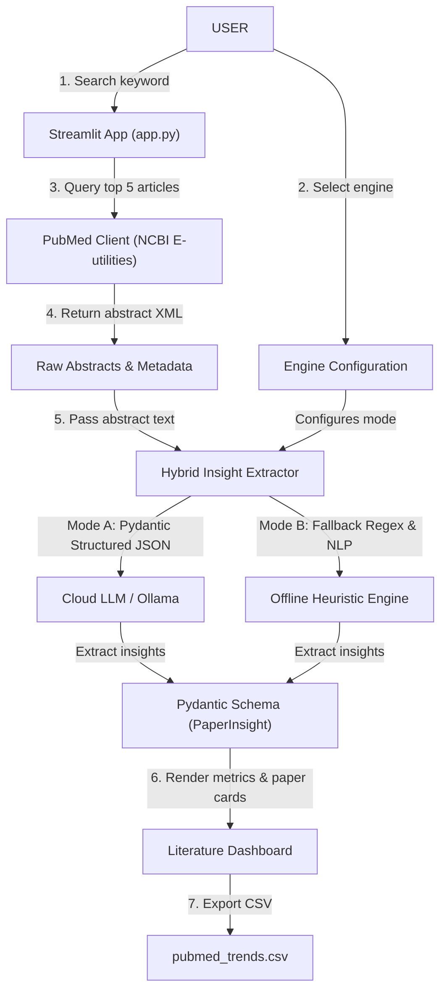

# Scientific Literature Trend Finder


## Quick Start (How to Run)

### Option 1: Run with Docker Compose (Recommended)

Start the app and local Ollama model together:

```bash
docker compose up --build
```

Access the Streamlit interface at http://localhost:8501.

### Option 2: Run Locally with Python

1. Install dependencies:
```bash
pip install -r requirements.txt
```

2. Start Streamlit:
```bash
python3 -m streamlit run app.py
```

Access the application at http://localhost:8501.

---

## How to Use

1. Enter a scientific research keyword (e.g., "HIV phylogenetics") in the search bar or click a suggested topic button.
2. Choose an extraction engine in the sidebar:
   - **Offline Heuristic Engine:** Free, instant extraction without API keys.
   - **Local Ollama Model:** Free offline LLM inference (`llama3.2`).
   - **Google Gemini / Groq / OpenAI:** Cloud LLM extraction using your API key.
3. Click **Find Trends** to view structured 2-bullet summaries, locations, sample sizes, and study types.
4. Click **Export Results to CSV** to download the structured table.

---

## Use Case Diagram




